<div align="center">

  

  <p><strong>A production-ready, end-to-end MLOps pipeline for real-time fraud detection — powered by PyTorch, MLflow, Kafka, Prefect, and Streamlit.</strong></p>

  <br/>

  <p>
    <a href="https://github.com/Kalinduwije22/FraudOps/stargazers">
      
    </a>
    <a href="https://github.com/Kalinduwije22/FraudOps/network/members">
      
    </a>
    <a href="https://github.com/Kalinduwije22/FraudOps/issues">
      
    </a>
    <a href="https://github.com/Kalinduwije22/FraudOps/blob/main/LICENSE">
      
    </a>
  </p>

  <p>
    
    
    
    
    
    
    
  </p>

  <br/>

  <p>
    <a href="#-overview">Overview</a> &nbsp;•&nbsp;
    <a href="#-tech-stack">Tech Stack</a> &nbsp;•&nbsp;
    <a href="#-repository-structure">Structure</a> &nbsp;•&nbsp;
    <a href="#-ml-pipeline">ML Pipeline</a> &nbsp;•&nbsp;
    <a href="#-getting-started">Getting Started</a> &nbsp;•&nbsp;
    <a href="#-usage">Usage</a> &nbsp;•&nbsp;
    <a href="#-contributing">Contributing</a>
  </p>

</div>

---

## 📖 Overview

**FraudOps** is a comprehensive, production-ready **Machine Learning Operations (MLOps)** framework purpose-built for **real-time financial fraud detection**.

It goes far beyond a simple model training script — it is a **full lifecycle system** that automates everything from data generation and model training to live transaction streaming, experiment tracking, automated orchestration, and interactive web-based inference. Every component is modular, reproducible, and built with industry-standard tools.

> 🎯 **Goal:** Detect fraudulent transactions in real time with a deep-learning model, while keeping every experiment fully reproducible and ready for production deployment.

---

## ✨ Features

<table>
  <tr>
    <td>🧠 <strong>Deep Learning Model</strong></td>
    <td>Custom <code>FraudNet</code> neural network built with <strong>PyTorch</strong>, trained on class-imbalanced transaction data (95% legit / 5% fraud).</td>
  </tr>
  <tr>
    <td>📈 <strong>Experiment Tracking</strong></td>
    <td><strong>MLflow</strong> logs every hyperparameter, loss curve, and model artifact automatically on every training run.</td>
  </tr>
  <tr>
    <td>⚡ <strong>Real-Time Streaming</strong></td>
    <td><strong>Apache Kafka</strong> (via Docker) powers a live transaction stream. A producer generates fake transactions; the model consumes and scores them instantly.</td>
  </tr>
  <tr>
    <td>🔄 <strong>Pipeline Orchestration</strong></td>
    <td><strong>Prefect</strong> automates the training workflow as a managed flow with a visual dashboard.</td>
  </tr>
  <tr>
    <td>🌐 <strong>Interactive Web Dashboard</strong></td>
    <td><strong>Streamlit</strong> web app for model inference — submit transaction features and get fraud predictions live.</td>
  </tr>
  <tr>
    <td>⚙️ <strong>Config-Driven</strong></td>
    <td>All model hyperparameters, data settings, and Kafka config live in <code>config/config.yaml</code> — no code changes needed to experiment.</td>
  </tr>
  <tr>
    <td>🐳 <strong>Dockerized Infrastructure</strong></td>
    <td>Kafka & Zookeeper spin up with a single <code>make infra-up</code> command. No manual setup required.</td>
  </tr>
  <tr>
    <td>🛠️ <strong>Makefile Automation</strong></td>
    <td>Every workflow step — setup, train, stream, predict, deploy — is a single <code>make</code> command away.</td>
  </tr>
</table>

---

## 🔧 Tech Stack

| Layer | Technology | Purpose |
|---|---|---|
| **Model** | PyTorch | Neural network training & inference |
| **Tracking** | MLflow | Experiment logging & model registry |
| **Streaming** | Apache Kafka | Real-time transaction data pipeline |
| **Orchestration** | Prefect | Automated training workflow |
| **Web UI** | Streamlit | Interactive prediction dashboard |
| **Infrastructure** | Docker & Docker Compose | Kafka + Zookeeper environment |
| **Config** | YAML | Centralized hyperparameter management |
| **Automation** | GNU Make | One-command pipeline execution |

---

## 📂 Repository Structure

```
FraudOps/
│
├── 📁 artifacts/               # 💾 Trained model weights & scalers (fraud_model.pth)
├── 📁 config/
│   └── config.yaml             # ⚙️  All hyperparameters, data config, Kafka settings
│
├── 📁 mlruns/                  # 📊 MLflow experiment run history
├── mlflow.db                   # 🗄️  SQLite backend for MLflow tracking
│
├── 📁 src/                     # 🧩 Core ML modules
│   ├── dataset.py              #    PyTorch Dataset wrapper
│   ├── model.py                #    FraudNet neural network definition
│   ├── train.py                #    Full training pipeline with MLflow logging
│   ├── inference.py            #    Kafka consumer + real-time predictor
│   ├── producer.py             #    Kafka transaction stream producer
│   ├── orchestrate.py          #    Prefect flow definition
│   └── utils.py                #    Shared utilities (config loader)
│
├── 📁 web/
│   └── app.py                  # 🌐 Streamlit web dashboard for predictions
│
├── main.py                     # 🚀 Unified CLI entry point (train/stream/predict/web)
├── Makefile                    # 🛠️  All automation commands
├── .gitignore
└── .large_files.txt            # 📦 References to large tracked files
```

---

## 🔬 ML Pipeline

```mermaid
flowchart LR
    A[⚙️ config.yaml] --> B[📊 Data Generation\nSklearn make_classification\n20K samples · 15 features]
    B --> C[🧠 FraudNet Training\nPyTorch · BCE Loss\nAdam · 50 Epochs]
    C --> D[📈 MLflow Tracking\nParams · Loss · Model Artifact]
    D --> E[💾 artifacts/\nfraud_model.pth]
    E --> F{Choose Mode}
    F -->|predict| G[⚡ Kafka Stream\nReal-time scoring]
    F -->|web| H[🌐 Streamlit\nInteractive Dashboard]
```



### Model Architecture — `FraudNet`

The core model is a **Feed-Forward Neural Network** (`FraudNet`) trained to classify transactions as fraudulent or legitimate:

```
Input (15 features)
      ↓
  Linear(15 → 64)  +  ReLU
      ↓
  Linear(64 → 1)   +  Sigmoid
      ↓
Output (fraud probability: 0.0 – 1.0)
```

**Training Configuration** (from `config.yaml`):

| Parameter | Value |
|---|---|
| Samples | 20,000 (95% legit / 5% fraud) |
| Features | 15 |
| Hidden Dim | 64 |
| Learning Rate | 0.001 |
| Batch Size | 64 |
| Epochs | 50 |
| Loss Function | Binary Cross-Entropy |
| Optimizer | Adam |

---

## 🚀 Getting Started

### 🛠️ Prerequisites

Ensure you have the following installed:

| Tool | Version | Notes |
|---|---|---|
| Python | 3.8+ | Recommended: 3.10 |
| Docker Desktop | Latest | Required for Kafka streaming |
| GNU Make | Any | Pre-installed on Linux/macOS. Windows: [GnuWin32](http://gnuwin32.sourceforge.net/packages/make.htm) |
| Git | Any | For cloning the repo |
| CUDA *(optional)* | 12.1 | For GPU-accelerated training |

### 📥 Installation

**1. Clone the repository**

```bash
git clone https://github.com/Kalinduwije22/FraudOps.git
cd FraudOps
```

**2. Set up the virtual environment and install all dependencies**

```bash
make setup
```

> This creates a `fraud_env/` virtual environment and installs: `torch`, `mlflow`, `kafka-python-ng`, `streamlit`, `scikit-learn`, `prefect`, `pyyaml`, and `pandas`.

**3. (For Kafka streaming) Start the infrastructure**

```bash
make infra-up
```

> This uses Docker Compose to spin up **Kafka** and **Zookeeper** locally on `localhost:29092`.

---

## 💻 Usage

All commands are available through the `Makefile`. Here is the full workflow:

### 1. 🧠 Train the Model

Runs the end-to-end training pipeline: generates data, trains `FraudNet`, logs everything to MLflow, and saves the model.

```bash
make train
# or
python main.py train
```

### 2. 📊 View Experiment Dashboard (MLflow)

Visualize all training runs, compare metrics, and download model artifacts.

```bash
mlflow ui --backend-store-uri sqlite:///mlflow.db
```

> Open your browser at **http://127.0.0.1:5000**

### 3. ⚡ Start Real-Time Transaction Stream (Kafka)

Requires `make infra-up` to be running. Opens a producer that generates synthetic fraud transactions and sends them to the Kafka topic `transaction_stream`.

```bash
make stream
# or
python main.py stream
```

### 4. 🔍 Start the Real-Time Predictor

Consumes the Kafka stream and prints live fraud predictions to the terminal.

```bash
make predict
# or
python main.py predict
```

### 5. 🌐 Launch the Web Dashboard (Streamlit)

Serves the Streamlit web app where you can manually input transaction features and get instant fraud predictions.

```bash
make web
# or
python main.py web
```

> Open your browser at **http://localhost:8501**

### 6. 🔄 Run as an Orchestrated Flow (Prefect)

Runs the training pipeline as a Prefect managed flow for automated, scheduled execution.

```bash
make flow
```

To view the Prefect orchestration dashboard:

```bash
make flow-ui
```

### 7. 🧹 Clean Up

Removes all `__pycache__` directories and `.pyc` files.

```bash
make clean
```

### ⚡ Quick Reference

| Command | Action |
|---|---|
| `make setup` | Create venv & install dependencies |
| `make infra-up` | Start Kafka + Zookeeper (Docker) |
| `make infra-down` | Stop Docker containers |
| `make train` | Train the PyTorch model |
| `make stream` | Start Kafka transaction producer |
| `make predict` | Start real-time Kafka consumer/predictor |
| `make web` | Launch Streamlit web dashboard |
| `make flow` | Run automated Prefect training flow |
| `make flow-ui` | Start Prefect dashboard server |
| `make clean` | Remove cache files |

---

## ⚙️ Configuration

All pipeline parameters are controlled from a single file — **`config/config.yaml`**:

```yaml
project:
  name: "Fraud_Detection_System"
  experiment_name: "Pytorch_Fraud_Experiment_v1"

data:
  num_samples: 20000       # Total training samples
  num_features: 15         # Input feature count
  test_size: 0.2           # 80/20 train/test split
  save_path: "artifacts/"  # Where models are saved

model:
  input_dim: 15
  hidden_dim: 64
  output_dim: 1
  learning_rate: 0.001
  epochs: 50
  batch_size: 64

kafka:
  bootstrap_servers: "localhost:29092"
  topic_input: "transaction_stream"
  group_id: "fraud_detector_group"
```

---

## 🤝 Contributing

Contributions make the open-source community an amazing place to learn, inspire, and create. **Any contribution is greatly appreciated!**

1. 🍴 **Fork** the repository
2. 🌿 **Create** your feature branch
   ```bash
   git checkout -b feature/AmazingFeature
   ```
3. 💾 **Commit** your changes
   ```bash
   git commit -m "feat: Add some AmazingFeature"
   ```
4. 🚀 **Push** to the branch
   ```bash
   git push origin feature/AmazingFeature
   ```
5. 📬 **Open a Pull Request** and describe your changes

### 💡 Ideas for Contributions

- [ ] Add model evaluation metrics (F1, AUC-ROC, Precision, Recall)
- [ ] Integrate a real-world fraud dataset (e.g., IEEE-CIS, Kaggle credit card fraud)
- [ ] Add Docker container for the full application
- [ ] Implement model versioning and A/B testing with MLflow Model Registry
- [ ] Add CI/CD pipeline with GitHub Actions
- [ ] Extend the Streamlit dashboard with charts and history

---

## 📜 License

Distributed under the **MIT License**. See [`LICENSE`](LICENSE) for more information.

---

<div align="center">

  <h3>⭐ If you find this project useful, please consider giving it a star!</h3>
  <p>It helps others discover this project and motivates further development.</p>

  <br/>

  <a href="https://github.com/Kalinduwije22/FraudOps/stargazers">
    
  </a>

  <br/><br/>

  <p>Built with ❤️ by <a href="https://github.com/Kalinduwije22"><strong>Kalinduwije22</strong></a></p>

  

</div>